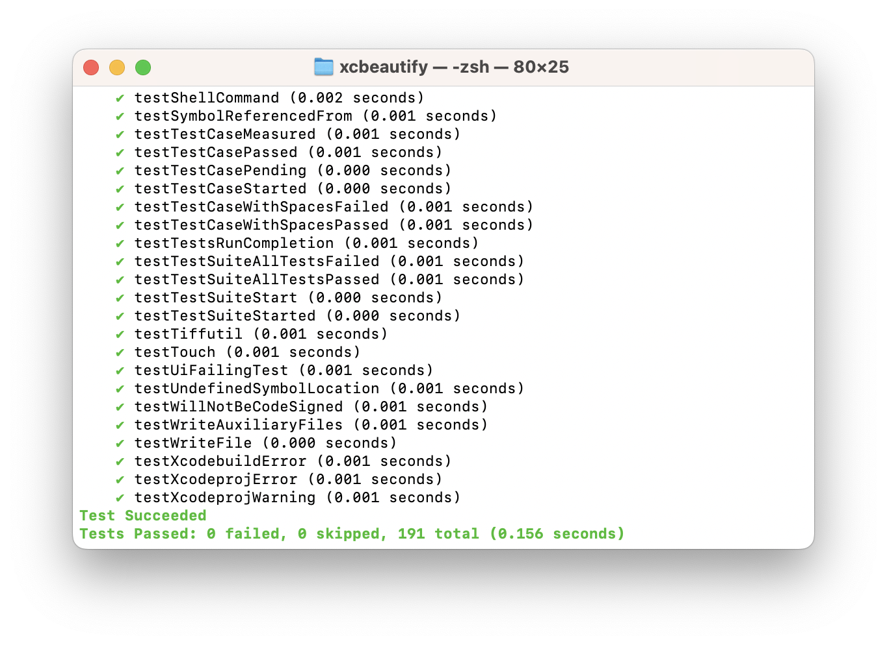
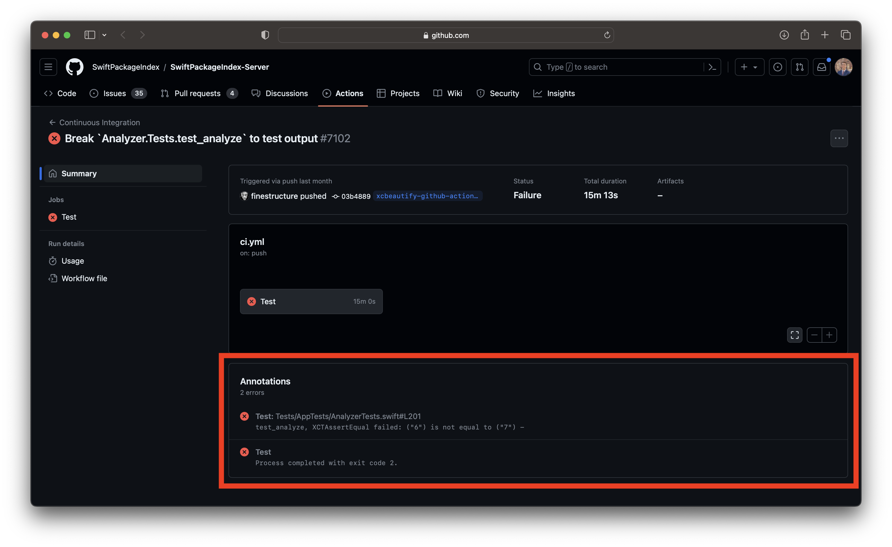
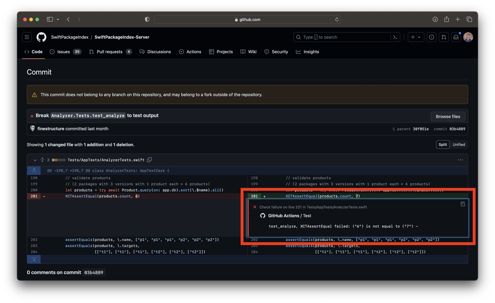

# xcbeautify

[](https://swiftpackageindex.com/cpisciotta/xcbeautify)
[](https://github.com/cpisciotta/xcbeautify/actions/workflows/ci.yml)
[](https://github.com/cpisciotta/xcbeautify/releases/latest)
[](LICENSE.md)



**`xcbeautify` is a little beautifier tool for `xcodebuild`.**

Similar to `xcpretty`, but faster.

## Features

- [x] 2x faster than `xcpretty`.
- [x] Human-friendly and colored output.
- [x] Supports the new build system's output.
- [x] Supports Xcode's parallel testing output.
- [x] Supports formatting Swift Package Manager output.
- [x] Supports generating JUnit reports.
- [x] Supports macOS & Linux.
- [x] Written in Swift: `xcbeautify` compiles to a static binary which you can
  bring anywhere. This also means less Ruby-dependant in your development
  environment and CI.

## Fun fact

`xcbeautify` uses itself to format its CI build logs.

## Installation

### Homebrew

```bash
brew install xcbeautify
```

### [Mint](https://github.com/yonaskolb/mint)

```bash
mint install cpisciotta/xcbeautify
```

### Swift Package Manager

Create a directory in the same location as the `xcodeproj` file, for example `BuildTools`.  
In that directory, create a `Package.swift` file with the following contents.  
In addition, add an empty file named `Empty.swift` to the same location.

```swift
// swift-tools-version: 5.9
import PackageDescription

let package = Package(
    name: "BuildTools",
    platforms: [.macOS(.v10_11)],
    dependencies: [
      .package(url: "https://github.com/cpisciotta/xcbeautify", from: "0.13.0"),
    ],
    targets: [
      .target(name: "BuildTools", path: "")
    ]
)
```

Enter this command to execute.  
```
swift run -c release --package-path ./BuildTools xcbeautify
```

### Build from source

```bash
git clone https://github.com/cpisciotta/xcbeautify.git
cd xcbeautify
make install
```

## Usage

```bash
xcodebuild [flags] | xcbeautify
```

If you want `xcbeautify` to exit with the same status code as `xcodebuild`
(e.g. on a CI):

```bash
set -o pipefail && xcodebuild [flags] | xcbeautify
```

For parallel and concurrent destination testing, it helps to use unbuffered I/O for _stdout_ and to redirect _stderr_ to _stdout_.

```bash
NSUnbufferedIO=YES xcodebuild [flags] 2>&1 | xcbeautify
```

```bash
swift test [flags] 2>&1 | xcbeautify
```

### GitHub Actions

|  |
|:--:|
| *GitHub Actions Summary* |

|  |
|:--:|
| *GitHub Actions Comment* |

`xcbeautify` features an integrated GitHub Actions renderer that harnesses [workflow commands](https://docs.github.com/en/actions/using-workflows/workflow-commands-for-github-actions) to highlight warnings, errors, and results directly within the GitHub user interface. To utilize this function, simply run `xcbeautify` and add the `--renderer github-actions` flag during execution:

```
set -o pipefail && xcodebuild [flags] | xcbeautify --renderer github-actions
```

## Development

Generate Xcode project:

```sh
make xcode
```

Release a new version, e.g. `x.y.z`:

```bash
make release version=x.y.z
```

## Contributing

Please send a PR!
