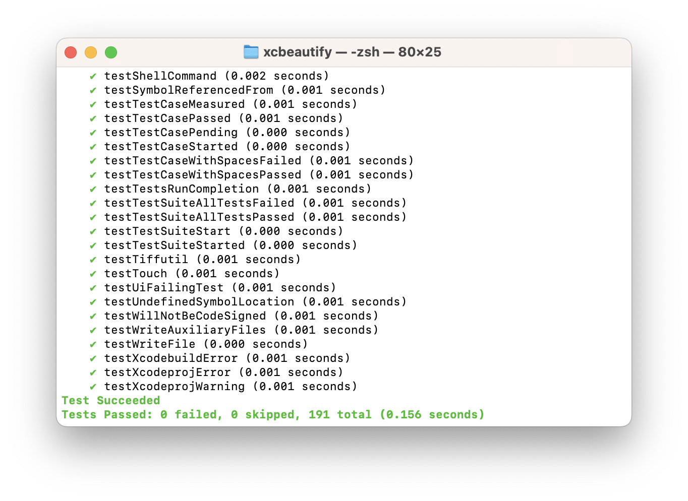
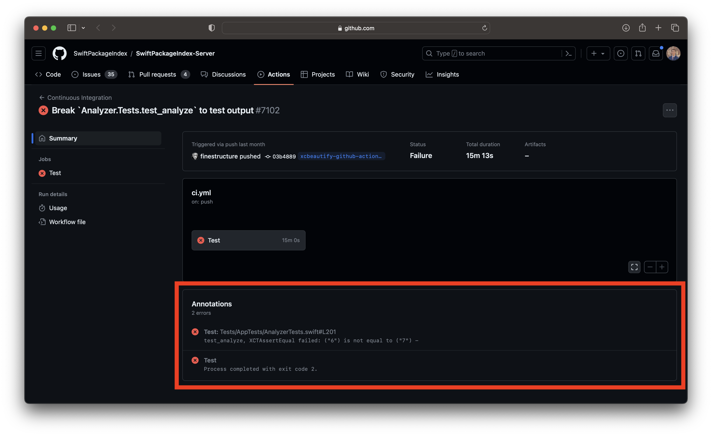
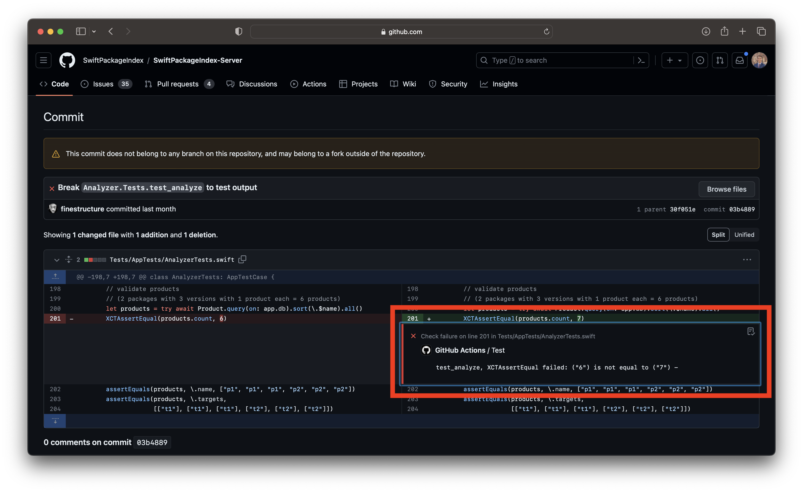

# xcbeautify

[](https://swiftpackageindex.com/cpisciotta/xcbeautify)
[](https://github.com/cpisciotta/xcbeautify/actions/workflows/ci.yml)
[](https://github.com/cpisciotta/xcbeautify/releases/latest)
[](LICENSE)



**`xcbeautify` is a little beautifier tool for `xcodebuild` and `swift` output.**

A faster alternative to `xcpretty` written in Swift.

## Features

- [x] Human-friendly and colored output.
- [x] Supports the new build system's output.
- [x] Supports Xcode's parallel testing output.
- [x] Supports formatting Swift Package Manager output.
- [x] Supports generating JUnit reports.
- [x] Supports macOS & Linux.
- [x] Written in Swift and distributed as a native CLI binary (no Ruby runtime).

## Requirements

- Swift 6.1+
- macOS 14+ for local builds via Swift Package Manager

## Installation

### Homebrew

```bash
brew install xcbeautify
```

### [Mint](https://github.com/yonaskolb/mint)

```bash
mint install cpisciotta/xcbeautify
```

### Build from source

```bash
git clone https://github.com/cpisciotta/xcbeautify.git
cd xcbeautify
make install
```

If you prefer not to install globally:

```bash
swift build -c release --disable-sandbox --product xcbeautify
```

## Usage

```bash
xcodebuild [flags] | xcbeautify
```

If you want `xcbeautify` to exit with the same status code as `xcodebuild`
(e.g. on a CI):

```bash
set -o pipefail && xcodebuild [flags] | xcbeautify
```

For parallel and concurrent destination testing, it helps to use unbuffered I/O for _stdout_ and to redirect _stderr_ to _stdout_.

```bash
NSUnbufferedIO=YES xcodebuild [flags] 2>&1 | xcbeautify
```

```bash
swift test [flags] 2>&1 | xcbeautify
```

### Command-line options

- For the latest complete list, run:

```bash
xcbeautify --help
```

Commonly used options are grouped below by behavior.

**Output filtering**

- `-q`, `--quiet`: show only tasks that include warnings or errors.
- `-qq`, `--quieter`: show only tasks that include errors.
- `--is-ci`: include test result summary when using quiet modes.
- `--preserve-unbeautified`: keep lines that do not match known parsers.

**Output style**

- `--disable-colored-output`: disable ANSI colors.
  - Colors are also disabled when `NO_COLOR` is set.
- `--disable-logging`: suppress the startup info table (including version).

**Renderer selection**

- `--renderer <terminal|github-actions|teamcity|azure-devops-pipelines>`
- If `--renderer` is not provided, `xcbeautify` auto-selects for common CI
  environments and falls back to `terminal` otherwise.

`--renderer` is selected automatically for common CI environments when not
provided:

- `GITHUB_ACTIONS=true` → `github-actions`
- `TEAMCITY_VERSION` set → `teamcity`
- `AZURE_DEVOPS_PIPELINES` set → `azure-devops-pipelines`

**Report generation**

- `--report junit`: generate a JUnit report.
- `--report-path <path>`: set the report output directory.
- `--junit-report-filename <name>`: set the JUnit XML file name.

### Behavior notes

- Input is processed as a stream, line by line.
- Empty/whitespace-only lines are skipped.
- Unrecognized lines are omitted by default; use `--preserve-unbeautified` to keep them.

### JUnit report output

Generate a JUnit report:

```bash
set -o pipefail && xcodebuild [flags] | xcbeautify --report junit
```

Customize the output directory and file name:

```bash
set -o pipefail && xcodebuild [flags] | xcbeautify \
  --report junit \
  --report-path build/reports \
  --junit-report-filename junit.xml
```

### CI renderers

Use a specific renderer when you want CI-native annotations:

```bash
set -o pipefail && xcodebuild [flags] | xcbeautify --renderer <renderer>
```

Supported renderer values:

- `github-actions` ([workflow commands](https://docs.github.com/en/actions/using-workflows/workflow-commands-for-github-actions))
- `teamcity` ([service messages](https://www.jetbrains.com/help/teamcity/service-messages.html))
- `azure-devops-pipelines` ([logging commands](https://learn.microsoft.com/en-us/azure/devops/pipelines/scripts/logging-commands))

#### GitHub Actions

|  |
|:--:|
| *GitHub Actions Summary* |

|  |
|:--:|
| *GitHub Actions Comment* |

```bash
set -o pipefail && xcodebuild [flags] | xcbeautify --renderer github-actions
```

#### TeamCity

```bash
set -o pipefail && xcodebuild [flags] | xcbeautify --renderer teamcity
```

#### Azure DevOps Pipeline

```bash
set -o pipefail && xcodebuild [flags] | xcbeautify --renderer azure-devops-pipelines
```

## Development

Open in Xcode:

```sh
make xcode
```

Common local commands:

```bash
swift build -c debug --disable-sandbox --product xcbeautify
swift test
./tools/lint
./tools/format
```

## New contributors

- Start with [CONTRIBUTING.md](CONTRIBUTING.md) for setup, workflow, and validation.
- Release steps are maintainer-focused and documented in [docs/RELEASING.md](docs/RELEASING.md).

## Contributing

Contributions are welcome. Open an issue for discussion, then submit a PR.
